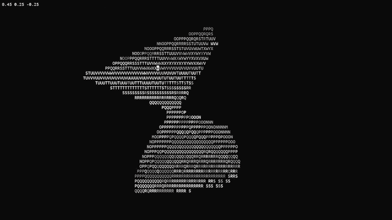

# EquationParser

Type an equation. See a 3D shape.

EquationParser takes a math string like `((x^2+y^2)^0.5 - 15)^2 + z^2 < 15` and renders the implicit 3D surface it describes — no mesh, no model, just an inequality over `x`, `y`, `z` evaluated at every point in space.



---

## What it does

You write an equation as a C string. The parser evaluates it at every point on a 3D grid. Wherever the condition holds, that point is part of the surface. The result gets rendered as a 3D shape.

```c
char *str = "((x^2+y^2)^0.5 - 15)^2 + z^2 < 15";  // donut
```

```c
char *str = "x^4 - 5*x^2 + y^4 - 5*y^2 + z^4 - 5*z^2 + 11.8 < 0";  // tanglecube
```

```c
char *str = "min(min(x^2+y^2, y^2+z^2), x^2+z^2) < 1";  // three intersecting cylinders
```

Any implicit surface you can express as an inequality over `x`, `y`, `z` — just type it.

---

## Equation syntax

| Category | What to write |
|---|---|
| Variables | `x` `y` `z` |
| Arithmetic | `+` `-` `*` `/` `^` |
| Grouping | `(` `)` |
| Comparison | `<` `>` `=` `<=` `>=` |
| Logic | `&` `\|` |
| Functions | `abs(v)` `min(a, b)` `max(a, b)` |
| Numbers | `3` `1.5` `0.75` etc. |

---

## How it works

**1. Tokenizer** — scans the string character by character into typed tokens: numbers, variables, operators, functions.

**2. Shunting-yard** — reorders tokens into Reverse Polish Notation, respecting operator precedence, parentheses, and unary operators.

**3. RPN evaluator** — walks the token queue, substitutes `x/y/z` from the current point, and applies operators via a number stack. Returns a single value.

**4. Visualization** — iterates over a 3D voxel grid, calls the evaluator at each point, and renders wherever the inequality holds.

Parse once, evaluate millions of points.

---

## API

```c
// Parse a string into a reusable RPN queue
tokenQueue q = init("(x^2 + y^2 + z^2)^0.5 < 1");

// Evaluate at any (x, y, z) point — non-destructive, call repeatedly
point p = {0.5, 0.5, 0.0};
double result = evalPolish(&q, p);

free_queue(&q);
```

### Functions

| Function | Description |
|---|---|
| `tokenQueue init(char* str)` | Parse equation string → RPN queue |
| `double evalPolish(tokenQueue* queue, point p)` | Evaluate queue at point `p` |
| `int parseRule(char* rule, token** res)` | Tokenize string, return token count |
| `void convertToPolish(...)` | Convert token array to RPN |

---

## Project structure

```
EquationParser/
├── include/        # Headers — parser.h, types, operator table
└── src/            # Sources — parser, stack, queue, operators
```

---

## Building

Plain C, no external dependencies:

```bash
gcc -o parser src/*.c -Iinclude -lm
```
